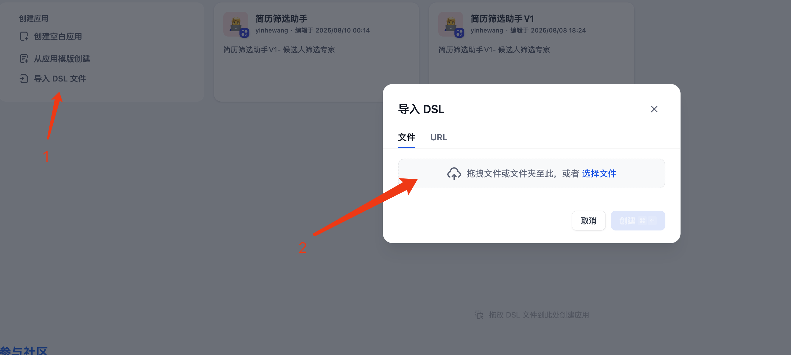

# Resume Screener Pro

[](https://github.com/wyh0626/resumeFilter)
[](LICENSE)
[](https://dify.ai)

[中文](README.md) | **English**

---

## 🌟 Resume Screener Pro

**An intelligent recruitment assistant that performs surgical-precision analysis on resumes**

### 📋 Project Description

Resume Screener Pro is inspired by [Resume Police](https://github.com/itMrBoy/resumePolice) and built on Dify workflow as an AI-powered recruitment tool.

### ✨ Key Features

* **🚀 Smart Quick Screen** - 30-second rapid assessment for initial filtering
* **🔍 Deep Analysis** - Six-dimensional comprehensive evaluation for key candidates
* **💡 Interview Question Design** - Generate targeted interview questions based on resume analysis
* **📊 Comprehensive Analysis** - All-in-one analysis combining all features above

### 🎯 Core Capabilities

#### P.O.S.E.R. Risk Assessment Model

* **P** (Problem): Business problem understanding depth
* **O** (Ownership): Authenticity of personal contributions
* **S** (Scale): Scale and complexity verification
* **E** (Engineering): Technical decision quality
* **R** (Results): Impact assessment of achievements

#### Six-Dimensional Deep Analysis

1. **Technical Competency (30%)** - Core skills matching, technical depth, architecture abilities
2. **Project Authenticity (25%)** - Scale reasonableness, technical selection logic, contribution clarity
3. **Problem-Solving (20%)** - Technical challenges overcome, solution trade-offs, innovation
4. **Growth Potential (10%)** - Tech stack updates, learning ability, career clarity
5. **Team Collaboration (10%)** - Cross-functional experience, mentoring, conflict resolution
6. **Stability Risk (5%)** - Job-hopping frequency, career path coherence, salary expectations

### 🚀 Quick Start

#### Installation

1. **Access Dify Platform**

   * Visit https://cloud.dify.ai/apps
   * Log into your account
2. **Import Workflow**

   ```bash
   # Download the workflow file
   git clone https://github.com/wyh0626/resumeFilter.git
   cd resumeFilter
   ```

   * Navigate to Workflows → Import DSL file
   * Select the workflow file `简历筛选助手.yml` from the `workflow` directory
   
   

3. **Configure AI Model**

   After importing the workflow, you need to configure the AI model:
   
   * Select model provider (supports any AI provider, such as OpenAI, Anthropic, Qwen, etc.)
   
   
   
   * Find the LLM nodes (AI model nodes in the workflow)
   
   
   
   * Select specific model
   
   
4. **Start Using**

   * Input job description (JD)
   * Upload candidate resumes (batch upload supported)
   * Select analysis mode
   * Get instant intelligent analysis results

### 📖 Usage Guide

#### Analysis Modes

| Mode                             | Use Case               | Output                                         |
| -------------------------------- | ---------------------- | ---------------------------------------------- |
| **Smart Quick Screen**     | Initial bulk screening | Pass/Fail decision + key findings              |
| **Deep Analysis**          | Shortlisted candidates | Six-dimensional detailed report                |
| **Interview Questions**    | Interview preparation  | 10 targeted questions with evaluation criteria |
| **Comprehensive Analysis** | Key positions          | Complete analysis package                      |

#### Input Parameters

* **Job Description (Required)** : Detailed position requirements and responsibilities
* **Resume Files (Required)** : Support batch upload up to 10 files
* **Special Requirements (Optional)** : Additional screening criteria
* **Analysis Mode** : Choose based on your needs

### 📄 License

This project is licensed under the MIT License - see the [LICENSE](LICENSE) file for details.

### 🙏 Acknowledgments

* Inspired by [Resume Police](https://github.com/itMrBoy/resumePolice)
* Powered by [Dify](https://dify.ai/) workflow engine

### 📮 Contact

* Issues: [GitHub Issues](https://github.com/wyh0626/resumeFilter/issues)
